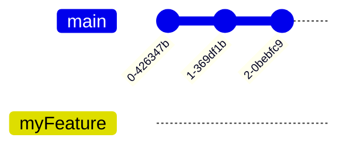
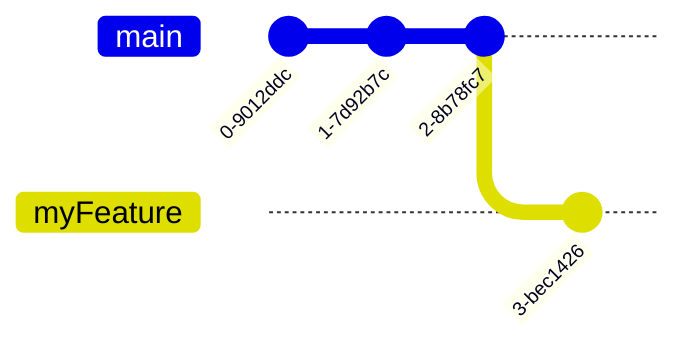
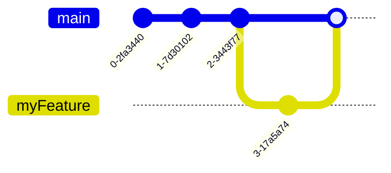

06. Checkout branche
mermaid main -> branche

```mermaid
---
checkout vers la branche de travail
---
gitGraph
  commit
  commit
  commit
  branch myFeature
  checkout myFeature
```

07. Commit

```mermaid
---
commit sur branche myFeature
---
gitGraph
  commit
  commit
  commit
  branch myFeature
  checkout myFeature
  commit
```
08. push
09. checkout main

10. merge from branche

```mermaid
---
merge from myFeature
---
gitGraph
  commit
  commit
  commit
  branch myFeature
  checkout myFeature
  commit
  checkout main
  merge myFeature
```
